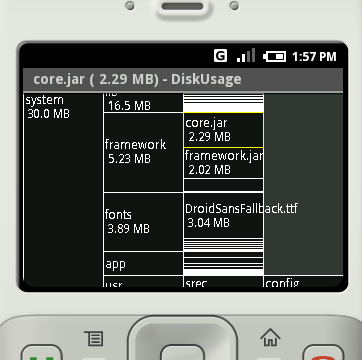

DiskUsage
=========

DiskUsage app for Android

DiskUsage provides a way to find files and directories on storage card which consumes a lot of space. 
It displays diagram on which directories are displayed proportional to their size, also a few levels of subdirectories are displayed. Users are allowed to zoom in to look at specific directory content. 
Purpose of the program is to provide a way to find and cleanup spacehogs on storage card. It is not general purpose file manager. 

Screenshot for an ancient version: 

YouTube video:
https://www.youtube.com/watch?v=TIiCQfWdtVg
